# Capturas De Pantalla

## Usuarios

## CREATE

### URL del endpoint

    https://localhost:7166/usuario

### Request 

    {
        "usuario" : "154998",
        "curso" : "mat214"
    }

### Response

    {
        "codigoAsignacion": "634eb9e8-e137-455e-8041-3ca03f23fac7",
        "nombres": "Mario Primero",
        "apellidos": "Lopez Garrido",
        "curso": "Matematica estandar",
        "descripcion": "descripcion de texto"
    }

### Captura de pantalla

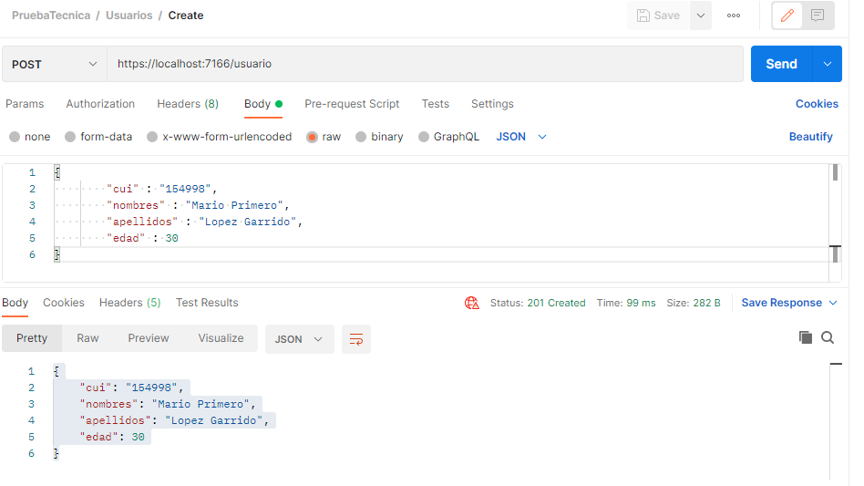

## UPDATE

### URL del endpoint

    https://localhost:7166/usuario/cui

### Request

    Cuerpo

    {
        "nombres" : "Nombre Segundo",
        "apellidos" : "Lopez Garrido",
        "edad" : 52
    }

### Response

    204 No Content

### Captura de pantalla

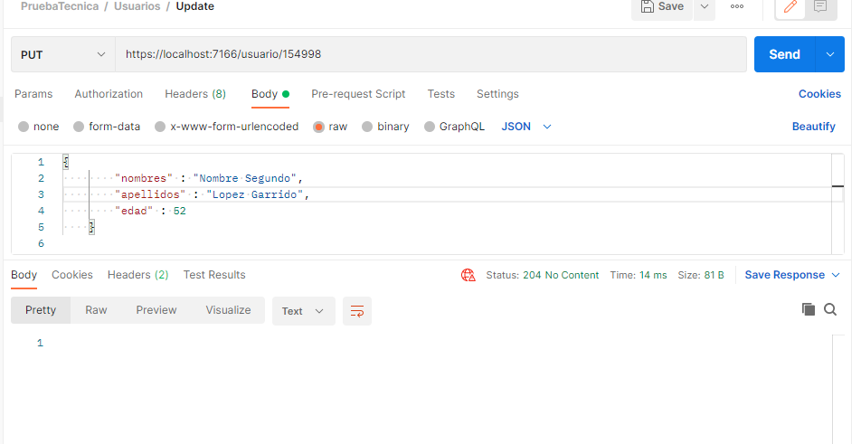

## DELETE

### URL del endpoint

    https://localhost:7166/usuario/cui

### Request

    No tiene Cuerpo

### Response

    204 No Content

### Captura de pantalla

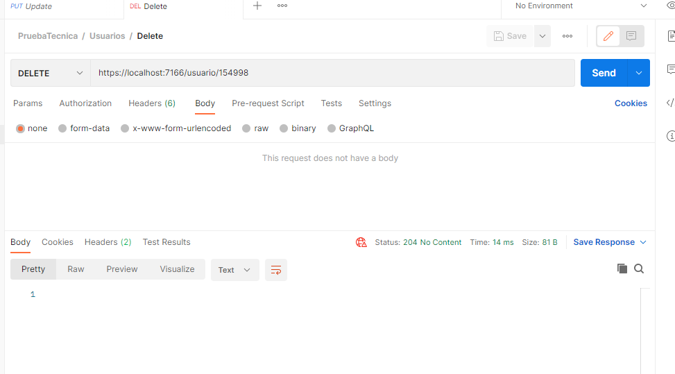

## READ

### URL del endpoint

    https://localhost:7166/usuario

### Request

    No tiene Cuerpo

### Response

    [
        {
            "cui": "1",
            "nombres": "Luis Mario ",
            "apellidos": "Perez Garcia",
            "edad": 21
        },
        {
            "cui": "2",
            "nombres": "Jose Ricardo",
            "apellidos": "Marquez Garrido",
            "edad": 22
        },
        {
            "cui": "3",
            "nombres": "Guillermo Alexander",
            "apellidos": "Ruiz Gonzales",
            "edad": 23
        }
    ]

### Captura de pantalla

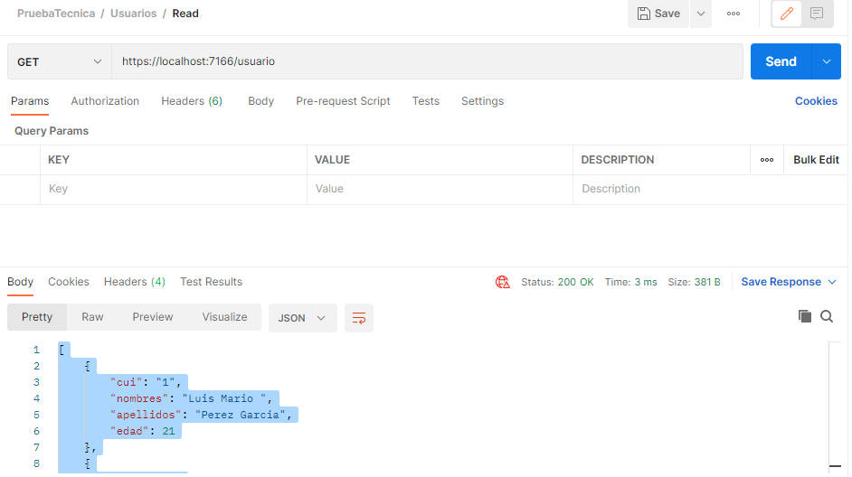

## Cursos

## CREATE

### URL del endpoint

    https://localhost:7166/curso

### Request

    {
        "codigo" : "mat214",
        "nombre" : "Matematica estandar",
        "descripcion" : "descripcion de texto"
    }

### Response

    {
        "codigo": "mat214",
        "nombre": "Matematica estandar",
        "descripcion": "descripcion de texto"
    }

### Captura de pantalla

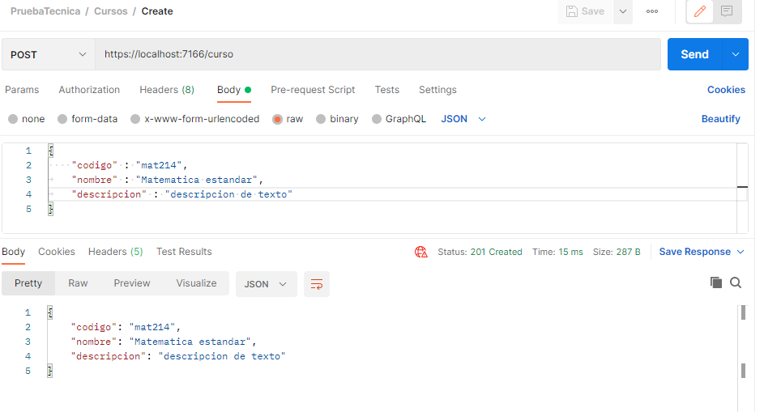

## UPDATE

### URL del endpoint

    https://localhost:7166/curso/codigo

### Request

    {
        "nombre" : "matematica avanzado",
        "descripcion" : "curso actualizado"
    }

### Response

    204 No Content

### Captura de pantalla

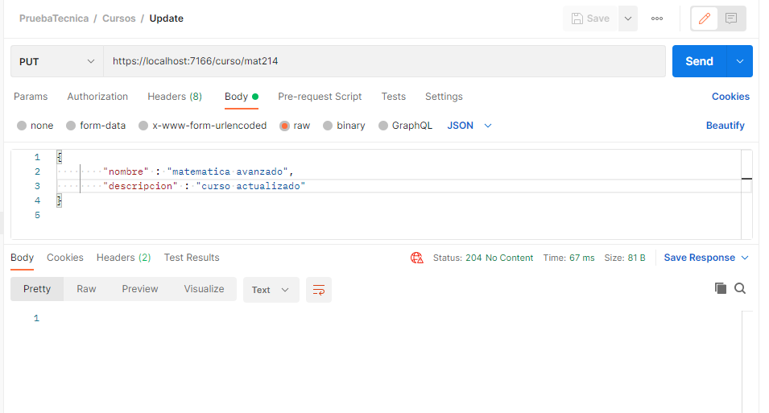

## DELETE

### URL del endpoint

    https://localhost:7166/curso/codigo

### Request

    No tiene cuerpo

### Response

    204 No Content

### Captura de pantalla

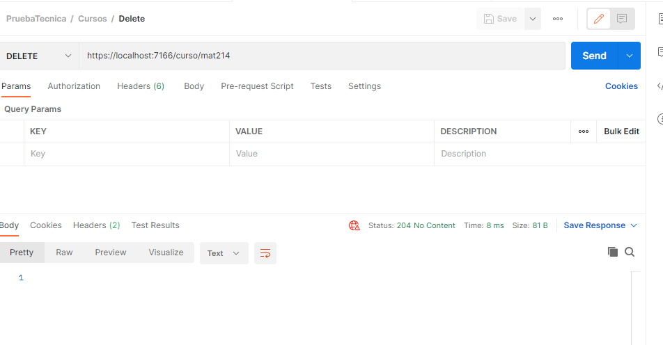

## READ

### URL del endpoint

    https://localhost:7166/curso

### Request

    No tiene cuerpo

### Response

    [
        {
            "codigo": "1",
            "nombre": "Matematica 0",
            "descripcion": "Curso de Matematica Iniciañ"
        },
        {
            "codigo": "2",
            "nombre": "Ordenamiento",
            "descripcion": "organizar  libros"
        },
        {
            "codigo": "3",
            "nombre": "Ingle",
            "descripcion": "Aprendizaje de otro idioma"
        }
    ]

### Captura de pantalla

## Asignaciones

## CREATE

### URL del endpoint

    https://localhost:7166/asignacion 

### Request

    {
        "codigo" : "mat214",
        "nombre" : "Matematica estandar",
        "descripcion" : "descripcion de texto"
    }

### Response

    {
        "codigo": "mat214",
        "nombre": "Matematica estandar",
        "descripcion": "descripcion de texto"
    }

### Captura de pantalla

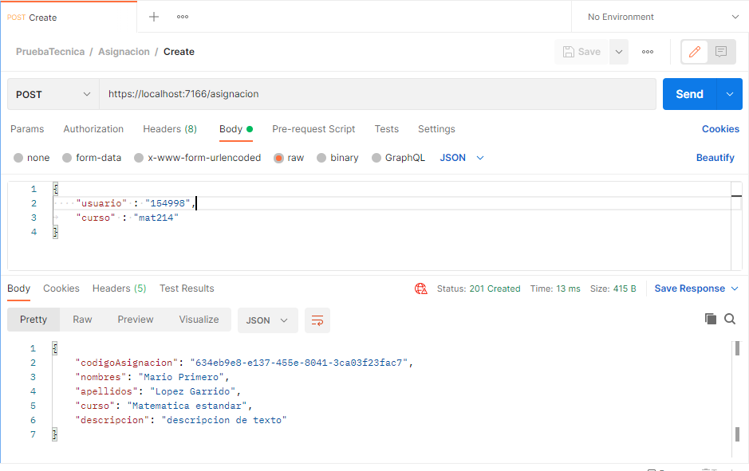

## UPDATE

### URL del endpoint

    https://localhost:7166/asignacion/codigoAsignacion 

### Request

    {
        "usuario" : "154998",
        "curso" : "1"
    }

### Response

    204 No content

### Captura de pantalla

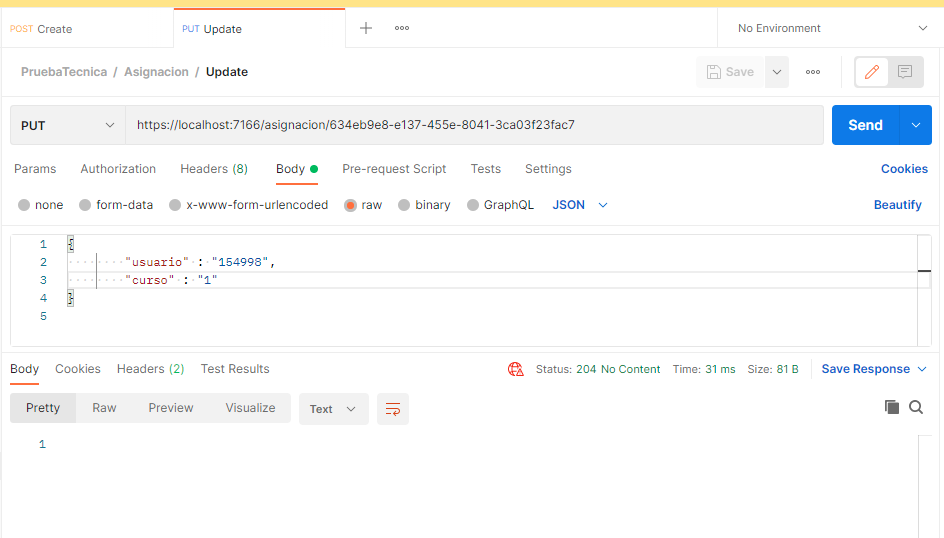

## DELETE

### URL del endpoint

    https://localhost:7166/asignacion/codigoAsignacion 

### Request

    No tiene cuerpo

### Response

    204 No content

### Captura de pantalla

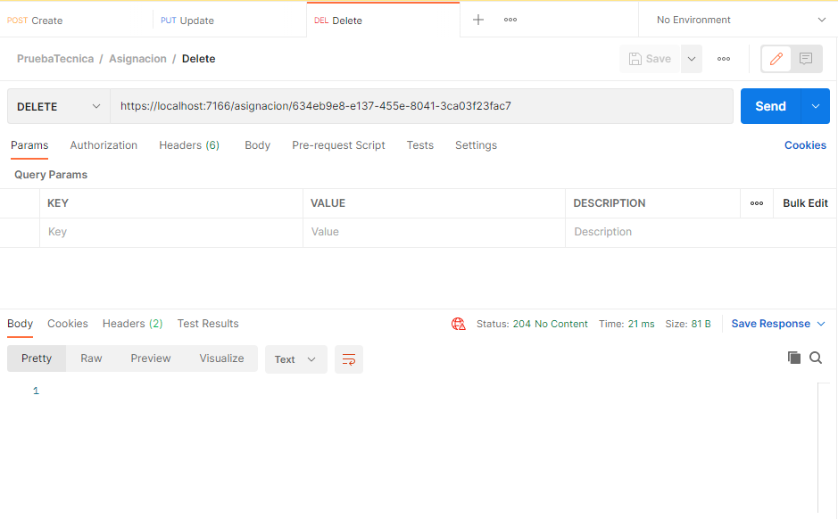

## READ

### URL del endpoint

    https://localhost:7166/asignacion

### Request

    No tiene cuerpo

### Response

    [
        {
            "codigo": "1",
            "nombre": "Matematica 0",
            "descripcion": "Curso de Matematica Iniciañ"
        },
        {
            "codigo": "2",
            "nombre": "Ordenamiento",
            "descripcion": "organizar  libros"
        },
        {
            "codigo": "3",
            "nombre": "Ingle",
            "descripcion": "Aprendizaje de otro idioma"
        },
        {
            "codigo": "mat214",
            "nombre": "Matematica estandar",
            "descripcion": "descripcion de texto"
        }
    ]

### Captura de pantalla

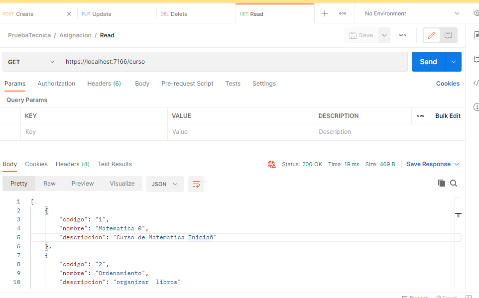

# Frontend React

## Vista Usuarios
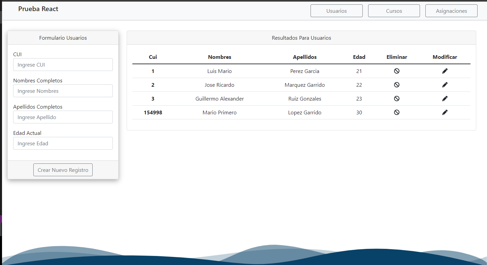
## Vista Cursos
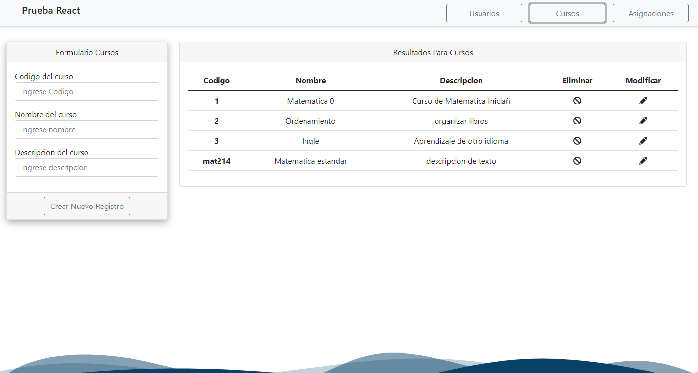
## Vista Asignaciones
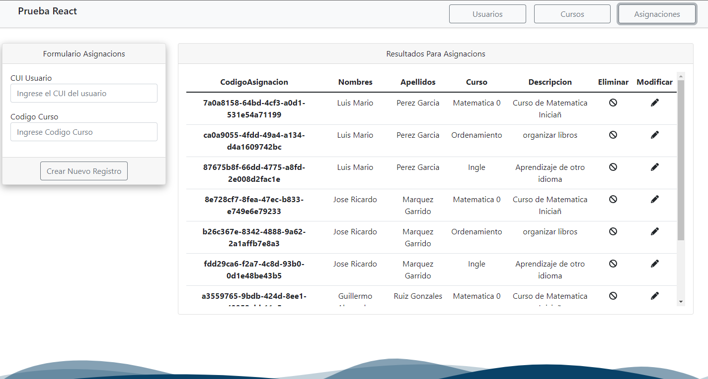